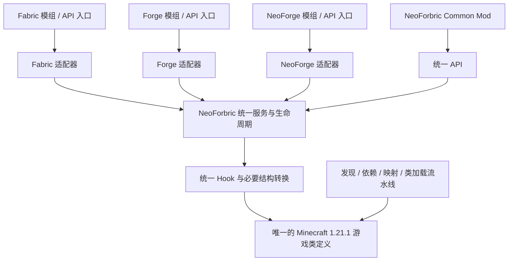

# 可行性与参考项目

日期：2026-10-06。适用版本：Minecraft 1.21.1。本文的“事实”有上游来源；“建议”是基于这些事实的工程判断。

## 1. README 中三个方向的判断

| 方向 | 调查判断 | 必须补充的约束 |
| --- | --- | --- |
| 生命周期统一 | 可以设计统一服务，由三个适配器调用 | 初始化阶段与运行事件分开；保留侧别、线程、阶段屏障与原有触发位置 |
| 基础代码 / 映射统一 | 可以统一开发命名、原版输入和最终游戏类定义 | 名称相同不等于方法描述符、类继承关系、注入锚点和行为相同 |
| 将必要 Patch 转成 Hook / API | 对部分 Patch 有效，必须按修改片段审计 | 一个文件可能同时包含事件插入、ABI 扩展、数据存储、协议变化和原版行为修正 |

一个统一内核通常可以比三套独立调度减少重复状态，但它同时接管了原来由加载器保证的条件，因此不能仅凭架构图推断兼容成功。

### 两类消费方

**NeoForbric 原生 Common Mod**：开发者只调用统一 API，可以接受项目新定义的时序和限制。这是验证统一模型的合适起点。

**现有 Fabric / Forge / NeoForge 模组**：其字节码已经写入原 API 类型、方法描述符、入口和注入目标。它们不会自动改为调用 NeoForbric API。需要适配器在保留可支持的原契约时，将调用接入统一服务；缺少的方法或接口还可能需要结构转换。

建议将支持状态分别标为“统一 API 可用”“原生态 API 子集可用”“指定 JAR 行为验证通过”，避免把三者混为一个兼容率。

## 2. Forbric：候选参考上游

README 提到了 `forbric`，但没有仓库链接、继承版本或提交信息。本次找到的同名公开项目是 [Ray-T-r/Minecraft-Forbric-mod-loader](https://github.com/Ray-T-r/Minecraft-Forbric-mod-loader)。**这是候选参考项目，尚不能从本地仓库证明它就是计划改版的准确上游。**

在调查快照 `520d7aad11cc7c9b8c8278b5f541e4429e1f7623` 中，该项目的 [主 README](https://github.com/Ray-T-r/Minecraft-Forbric-mod-loader/blob/520d7aad11cc7c9b8c8278b5f541e4429e1f7623/README.zh-CN.md) 面向 Minecraft **26.2**。不能把该版本的实现或测试报告直接当作 1.21.1 的依据。

其 [内核说明](https://github.com/Ray-T-r/Minecraft-Forbric-mod-loader/blob/520d7aad11cc7c9b8c8278b5f541e4429e1f7623/forbric-kernel/README.zh-CN.md) 区分了旧的加载器拼接实现和自主内核实现；后者集中拥有转换类加载器、生命周期与注册表，原生态作为适配器，Forge / NeoForge 运行时作为被动 API / ABI 载体。这与本项目的统一方向有参考价值，也说明“保留部分真实 API 实现”和“统一内核”可以并存。

值得借鉴的是单一运行模型、引导侧与游戏侧分离，以及逐项保留生态差异的方式。当前证据不足以支持直接回移整个 26.2 内核；需先确认准确上游与可复用模块，再审计 1.21.1 的入口和类结构。

上游 [失败报告](https://github.com/Ray-T-r/Minecraft-Forbric-mod-loader/blob/520d7aad11cc7c9b8c8278b5f541e4429e1f7623/MOD_TEST_FAILURES.md) 也明确区分进入世界、严格加载、实际行为和完整混装。本文没有复跑该项目的测试；它的结果不代表 NeoForbric 的结果。

## 3. Connector 与 Forgified Fabric API

[Connector 的 1.21.x 快照](https://github.com/Sinytra/Connector/blob/5a2f668ad492c1586c279a197423f5a1d1a16509/README.md) 描述的是在 NeoForge 上运行 Fabric 模组的兼容路径，并要求使用 Forgified Fabric API 替代原 Fabric API。[版本目录](https://github.com/Sinytra/Connector/blob/5a2f668ad492c1586c279a197423f5a1d1a16509/gradle/libs.versions.toml) 实际锁定 Minecraft 1.21.1，避免仅凭分支名猜测目标版本。

[Forgified Fabric API](https://github.com/Sinytra/ForgifiedFabricAPI/blob/c2cb2ae0db344bd2efcf2d4fc8770d298377faa0/README.md) 将 Fabric API 接到 NeoForge 的系统上，并说明公共 API 与内部实现的兼容承诺不同。[Connector 的 JarTransformer](https://github.com/Sinytra/Connector/blob/5a2f668ad492c1586c279a197423f5a1d1a16509/transformer/src/main/java/org/sinytra/connector/transformer/jar/JarTransformer.java) 则说明其兼容工作还包含 JAR 转换、缓存和转换审计。

可借鉴：Fabric 公共 API 的服务化、映射转换与结构修复分层、按 JAR 记录转换证据。边界：这是一条以 NeoForge 为宿主的路径，不能据此认定传统 Forge 模组也兼容；使用它作为对照或阶段实验，也不能代替自主内核的验证。

## 4. Architectury

[Architectury API 的项目说明](https://github.com/architectury/architectury-api) 展示了面向开发者的公共 API 抽象；其工具链支持共享代码与平台实现。适合作为 Common Mod API 的参考，但这种开发模型不会让任意现有 JAR 自动获得同一套运行语义。

## 5. 建议的最终边界

以下图是 **NeoForbric 设计草案**，不是现有实现：

- 内核拥有模组集合、依赖图、阶段推进、注册状态、线程调度和游戏类定义。
- 适配器处理原生态元数据、入口、API 类型、事件结果及必要的 ABI 兼容；它们不独立启动完整原生加载器。
- 统一 API 面向新模组，既有模组通过适配器接入相同服务。
- 游戏基底从固定的原版输入构建；所有行为与结构改动有清单、来源和验收项。

最大风险集中在注册冻结、伤害 / 交互语义、Mixin 锚点、数据持久化、网络握手以及客户端渲染。先覆盖一个可检查的子集，再决定扩大范围。
