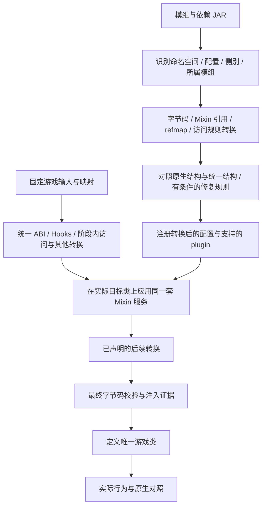

# 映射与 Mixin 兼容专项调查

调查日期：2026-10-06（日本时间）。目标：Minecraft Java Edition **1.21.1 / Java 21**。

本轮获取官方映射文件并核对了三个类和一个方法的跨命名空间对应关系，静态检查了 Fabric Loader、Connector、Sinytra Adapter、Mixin 0.8.7 与候选 Forbric 的相关源码片段。**没有转换真实模组 JAR、构建游戏基底或进行 Mixin / 游戏运行测试。** 来源与哈希见 [专项快照](mapping-mixin-snapshot.json)，前期背景见 [运行模型](02-runtime-model.md)。

## 1. 结论与优先级

映射和 Mixin 兼容应作为统一内核的前置工作。统一 Minecraft 基底需要同时具备三种能力：

| 层次 | 解决的问题 | 能否仅靠映射文件完成 |
| --- | --- | --- |
| 名称统一 | 类、字段、方法、描述符、Mixin 引用、访问规则采用同一命名空间 | 很多部分可机械转换，但需要完整类型上下文 |
| 结构适配 | Patch 移动调用点，修改参数 / 字段类型，改变继承或局部变量 | 不能；需要结构分析和有边界的修复规则 |
| 行为保持 | 注入真正执行，取消与副作用位置正确，多个模组共同工作 | 不能；需要最终字节码检查与原生行为对照 |

新 Common Mod 可以直接使用统一命名与稳定 Hook，减少对 Minecraft 内部位置的依赖；现成三端模组仍携带它们原来编译时的名称、结构假设和注入语义。统一 API 原型与既有 Mixin 兼容必须分别验收。

建议实现顺序：**映射闭环 → Mixin 引用转换 → 单一 Mixin 服务 → 无结构漂移样本 → 已知结构修复 → 多模组冲突与行为对照**。不要把 Mixin 修复推迟到“所有 API 完成以后”。

## 2. 1.21.1 的真实映射输入

本轮直接解析了以下发布文件，而不是根据类名印象构造映射：

| 输入 | 格式 / 文件头 | 用途 |
| --- | --- | --- |
| [Mojang 1.21.1 版本元数据](https://piston-meta.mojang.com/v1/packages/22a1966494dfa4eeb5ee778c8e6ed5b774839582/1.21.1.json) 中的 [client mappings](https://piston-data.mojang.com/v1/objects/2244b6f072256667bcd9a73df124d6c58de77992/client.txt) | ProGuard 格式，Mojang name → 原始混淆名 | 统一开发命名的候选基准；下载内容 SHA-1 与元数据一致 |
| [Intermediary 1.21.1 v2](https://maven.fabricmc.net/net/fabricmc/intermediary/1.21.1/intermediary-1.21.1-v2.jar) | `tiny 2 0 official intermediary` | 原始混淆空间与 Fabric 发布命名的桥 |
| [Yarn 1.21.1+build.3 v2](https://maven.fabricmc.net/net/fabricmc/yarn/1.21.1+build.3/yarn-1.21.1+build.3-v2.jar) | `tiny 2 0 intermediary named` | 一个具体 Yarn 开发命名版本 |
| [MCP config 1.21.1-20240808.132146](https://maven.minecraftforge.net/de/oceanlabs/mcp/mcp_config/1.21.1-20240808.132146/mcp_config-1.21.1-20240808.132146.zip) | `config/joined.tsrg`：`tsrg2 obf srg id` | 对应 Forge 分支配置的 SRG 成员映射输入 |

这里 Tiny 文件头的 `official` 表示原始混淆名，不能直接理解为“可读 Mojang names”；Yarn 的 `named` 也不是 Mojang 的 `named`。建议内核使用明确的内部空间标识，例如 `mc-obf-1.21.1`、`fabric-intermediary-1.21.1`、`yarn-1.21.1-build.3`、`mojang-1.21.1`，并保留原文件头作为来源信息。

### 已核对的类名

下表将包路径统一写成 JVM 内部名格式，Mojang 映射原文件采用点分形式。

| 原始混淆名 | Intermediary | Yarn build.3 | Mojang names |
| --- | --- | --- | --- |
| `cuq` | `net/minecraft/class_1799` | `net/minecraft/item/ItemStack` | `net/minecraft/world/item/ItemStack` |
| `btn` | `net/minecraft/class_1309` | `net/minecraft/entity/LivingEntity` | `net/minecraft/world/entity/LivingEntity` |
| `akr` | `net/minecraft/class_2960` | `net/minecraft/util/Identifier` | `net/minecraft/resources/ResourceLocation` |

`ItemStack#getCount()I` 的方法名对应关系也已核对：

```text
原始混淆名 H
    ↔ Intermediary method_7947
    ↔ Yarn getCount
    ↔ Mojang getCount
    ↔ MCP SRG 成员名 m_41613_
```

这些检查证明这组具体对应关系，不代表已经完成全量映射合成或 JAR 转换。参数和返回类型中包含游戏类的描述符还要一起转换；不能只替换方法名。

**MCP 特别注意**：原始 `joined.tsrg` 中，上述三类的 SRG 类列分别是 `net/minecraft/src/C_1391_`、`C_524_`、`C_5265_`。不能直接把这份原始表当作 Forge 部署产物的完整转换表。需要根据具体工具链和实际输入产物核对类命名与 SRG 成员命名的组合。[Forge 分支配置](https://github.com/MinecraftForge/MinecraftForge/blob/a11d1936c53f1f93787f239ff42cb8e93a1d037a/gradle.properties) 固定了此 MCP 版本；[AT 文档](https://docs.minecraftforge.net/en/1.21.x/advanced/accesstransformers/) 则展示了 Minecraft 类路径与 SRG 成员名的使用。

本轮只下载并解析客户端 Mojang 映射。专用服务器映射、两侧类型合并及发行 JAR 的实际命名尚未建立验证闭环。

## 3. 名称转换的完整范围

建议用 `(owner, name, descriptor, member-kind)` 识别成员，类继承和接口关系参与解析。仅靠 `name → name` 字典会混淆重载、继承方法和不同 owner 的同名成员。

| 输入位置 | 必须检查的内容 |
| --- | --- |
| 普通 class 字节码 | 类型、字段 / 方法引用、继承与接口、描述符、方法句柄、已支持的 invokedynamic 场景、签名 |
| Mixin 类型与成员 | `@Mixin` 目标、`@Shadow`、`@Overwrite`、`@Accessor`、`@Invoker`，以及相关注解的 remap 策略 |
| 注入选择器 | 注入器的 `method` / `target`、`@At.target`、slice 的边界、嵌套选择器及各自 remap 标志 |
| refmap | 顶层映射与命名环境映射、配置所引用的文件、plugin 返回的 refmap、来源 owner 与资源路径 |
| AT / AW | 类、成员、描述符、AW 文件头的命名空间与规则语义 |
| 运行时查询 | Fabric `MappingResolver`、受支持的反射查询、动态生成类型 / Mixin；不能把所有字符串都当作类名替换 |
| 模组与服务资源 | 入口、Mixin 配置、plugin、服务声明和内嵌 JAR 的归属关系 |

映射中没有的模组自有方法应按规则保留，不能因为查不到就删除。游戏成员若因 Patch 新增而缺少原版映射，需来自扩展 ABI 清单；未知游戏引用应给出可定位诊断。输入空间不能仅凭文件名猜测，多生态或已转换 JAR 还要避免重复转换。

Fabric Loader 的 [RuntimeModRemapper](https://github.com/FabricMC/fabric-loader/blob/fda9a7b84f0898f57b46fbbfda58795e7fa31cef/src/main/java/net/fabricmc/loader/impl/discovery/RuntimeModRemapper.java) 在需要 remap 的候选上配置 classpath、TinyRemapper、MixinExtension 和访问规则；[MappingConfiguration](https://github.com/FabricMC/fabric-loader/blob/fda9a7b84f0898f57b46fbbfda58795e7fa31cef/src/main/java/net/fabricmc/loader/impl/launch/MappingConfiguration.java) 则区分开发环境 `named` 与生产环境 `intermediary`。这些路径不能直接解释为原生 Loader 已提供跨 Forge / NeoForge 的结构修复。

### refmap 的两条输入路径

带 refmap 的 JAR 和已经把注解引用静态改写的 JAR 应分开识别。Loader 源码检查 `Fabric-Loom-Mixin-Remap-Type`，并对相关输入启用注解 remap；Connector 也对无 refmap 情况采取专门参数设置。

建议记录每个 JAR 的输入命名、每份 refmap 的来源环境与转换状态。转换完成后，类字节码、注解和 refmap 必须都指向同一运行空间；不能既把 refmap 改到目标空间，又由运行期 remapper 再按源空间处理一次。

`remap=false` 需要结合它所在注解与被引用成员的实际空间处理，不能整体忽略，也不能在 remapper 中一律覆盖。模组可能直接引用命名固定的外部 API，或者已经引用转换后的成员。

## 4. Patch 为什么会破坏 Mixin

Mixin 注入位置是对实际指令的查询。`INVOKE` 的 ordinal 是匹配目标调用中的序号；同名方法还在，某次调用、某个返回点或某个局部变量也可能已经变化。见 [Mixin 注入点参考](https://github.com/SpongePowered/Mixin/wiki/Injection-Point-Reference)。

| Mixin 形式 | 统一基底带来的风险 | 修复 / 验证要求 |
| --- | --- | --- |
| `@Inject` 的 HEAD / TAIL / RETURN | 原入口被包装、增加早退、方法体被移走 | 确认入口和返回范围；HEAD / TAIL 也不自动等价 |
| INVOKE / FIELD / NEW | owner、描述符、操作或调用位置被替换 | 名称对齐后比较实际指令与上下文，核对 opcode / slice / shift |
| ordinal / slice / shift | 新增或删除匹配点，边界漂移 | 重新识别原操作，不能简单让 ordinal 减一或取第一个匹配 |
| 局部变量捕获 / `@ModifyVariable` | 局部 slot、类型、生命周期或 typed ordinal 改变 | 检查帧、局部变量存活范围与处理器参数；同类型不等于同含义 |
| `@Redirect` | 调用已由其他注入器替换，或 Patch 改成多个操作 | 记录竞争与优先级，核对替换行为；不能静默丢掉另一方 |
| `@Shadow` / accessor / invoker | 字段变方法、成员类型改变、扩展方法移入接口 | 合法的描述符 / owner 适配及必要门面；映射不能创建缺失成员 |
| `@Overwrite` | 模组方法体覆盖统一 Hook 或其他 Patch 行为 | 单独审计；优先级解决不了丢失的语义 |
| MixinExtras | wrap 链、Operation、表达式和 `@Local` 有附加语义 | 核对插件版本、调用次数、返回值和取消传播，不通用地降成 `@Inject` |

[Mixin 0.8.7 的 RedirectInjector](https://github.com/SpongePowered/Mixin/blob/4053421aa10aaac6127d969028a29c94fe3054f6/src/main/java/org/spongepowered/asm/mixin/injection/invoke/RedirectInjector.java) 会检查重定向竞争和优先级，部分竞争路径会跳过注入或抛错。因此“Mixin 没有使整个进程崩溃”不等于每个模组的重定向都保留了。

## 5. 真实案例：ItemStack.useOn

[NeoForge 的 ItemStack Patch](https://github.com/neoforged/NeoForge/blob/a2d6402a3c1eec093aef7e7d10ac5145906c199e/patches/net/minecraft/world/item/ItemStack.java.patch) 为 `useOn` 增加事件和服务端分支，并将部分逻辑搬到 `onItemUse`、通过 callback 执行原物品操作。

原版 `useOn` 中的 `getItem()` 调用不能因此仍被假定处在同一个方法、分支和副作用位置。一个对该调用注入的 Fabric Mixin 即使 remap 完全正确，仍需要结构适配。

在调查的 [Connector MixinPatches](https://github.com/Sinytra/Connector/blob/5a2f668ad492c1586c279a197423f5a1d1a16509/transformer/src/main/java/org/sinytra/connector/transformer/transform/MixinPatches.java) 中，有明确规则把这类目标迁到 `connector_useOn` 并改为 RETURN 注入；[ItemStackMixin](https://github.com/Sinytra/Connector/blob/5a2f668ad492c1586c279a197423f5a1d1a16509/src/mod/java/org/sinytra/connector/mod/mixin/item/ItemStackMixin.java) 提供该辅助方法，并在指定 `lambda$useOn$16` 路径调用它。

这一案例说明可能需要修复 guest Mixin，同时在统一游戏基底中提供对应执行位置。辅助方法是特定兼容方案的一部分，lambda 序号也是具体版本的结构细节，不能当作所有 1.21.1 修订都稳定的 API。

上述 NeoForge 分支快照与 Connector 固定依赖不是本轮已运行验证的二进制组合。这里比较的是源码结构与修复思路，尚未证明该规则在 NeoForbric 中可以直接使用。

## 6. Connector / Adapter 的可借鉴机制

### JAR 转换与应用阶段分开

[JarTransformInstance](https://github.com/Sinytra/Connector/blob/5a2f668ad492c1586c279a197423f5a1d1a16509/transformer/src/main/java/org/sinytra/connector/transformer/jar/JarTransformInstance.java) 的相关流程包含：准备映射和 refmap，建立 clean 类视图与修复环境，执行名称转换、Mixin Patch、accessor 适配，写回 refmap 和生成的 Mixin 配置，并收集 AuditTrail。

[MixinPatchTransformer](https://github.com/Sinytra/Connector/blob/5a2f668ad492c1586c279a197423f5a1d1a16509/transformer/src/main/java/org/sinytra/connector/transformer/transform/MixinPatchTransformer.java) 还考虑未出现在静态配置里的 Mixin 类，以及生成类和配置的更新。这说明只读取一个 JSON 的 `mixins` 数组并改写 refmap，不足以覆盖它支持的输入形态。

### 两份结构视图与有限修复

Adapter [PatchEnvironment](https://github.com/Sinytra/Adapter/blob/38d859495426fadb5db8b52afdb88deaa7132322/core/src/main/java/org/sinytra/adapter/env/ctx/PatchEnvironment.java) 明确提供 clean / dirty class lookup。[InjectorOrdinalResolver](https://github.com/Sinytra/Adapter/blob/38d859495426fadb5db8b52afdb88deaa7132322/core/src/main/java/org/sinytra/adapter/patch/resolver/special/InjectorOrdinalResolver.java) 的一个分支比较原始与修改后的调用周围指令，只有匹配结果唯一时才迁移 ordinal。

[ComparingInjectionPointResolver](https://github.com/Sinytra/Adapter/blob/38d859495426fadb5db8b52afdb88deaa7132322/core/src/main/java/org/sinytra/adapter/patch/resolver/injection/ComparingInjectionPointResolver.java) 和 [SplitTargetMethodSubResolver](https://github.com/Sinytra/Adapter/blob/38d859495426fadb5db8b52afdb88deaa7132322/core/src/main/java/org/sinytra/adapter/patch/resolver/target/SplitTargetMethodSubResolver.java) 展示了比较调用、寻找拆分方法和处理迁移的路径；源码中仍有条件限制与未完成分支。结构匹配是修复候选的证据，不是通用的语义等价证明。

建议 NeoForbric 为每个生态保留其**预期原生结构视图**，与同命名空间下的统一基底比较。Fabric 原生视图也可能受该平台早期转换影响，不能永久简化成“完全未修改的原版”；Forge 与 NeoForge 更不能共用一份假定相同的 Patch 基线。最终还要观察实际 Mixin 应用时被其他转换器改写的目标。

Adapter 本次固定的是 `1.21.x` 分支源码快照，不是 Connector 所依赖发布 JAR 的源码一致性证明。是否复用其库，需要另行锁定 API、版本和可运行依赖组合。

## 7. 一套 Mixin 服务，保留配置差异

建议由 NeoForbric 拥有一个游戏类定义路径、一套 Mixin 服务和受控的初始化顺序。所有受支持的生态配置接入该服务；不要让 Knot 和 ModLauncher 各自建立一套转换目标。

版本管理至少包含 Java / ASM 支持、Mixin 版本与发行分支、MixinExtras 版本、配置 `compatibilityLevel`、plugin 和来源生态。相同的 `0.8.7` 主版本号不意味着 Fabric 分支扩展与所有服务契约一致。

本轮 Loader 0.16.10 配置为 `0.15.4+mixin.0.8.7`、MixinExtras 0.4.1；前期 NeoForge 快照配置为 `0.16.4+mixin.0.8.7`、MixinExtras 0.5.5。它们是调查样本，**不是把两份 Mixin 放进同一 classpath 的建议**。见 [Loader 配置](https://github.com/FabricMC/fabric-loader/blob/fda9a7b84f0898f57b46fbbfda58795e7fa31cef/gradle.properties) 与 [NeoForge 配置](https://github.com/neoforged/NeoForge/blob/a2d6402a3c1eec093aef7e7d10ac5145906c199e/gradle.properties)。

[Connector 的 FabricMixinBootstrap](https://github.com/Sinytra/Connector/blob/5a2f668ad492c1586c279a197423f5a1d1a16509/src/main/java/org/sinytra/connector/service/FabricMixinBootstrap.java) 按配置所属模组计算 Fabric 兼容信息并进行 decoration。该兼容信息与配置的 Java `compatibilityLevel` 应分别建模。

[IMixinConfigPlugin](https://github.com/SpongePowered/Mixin/blob/4053421aa10aaac6127d969028a29c94fe3054f6/src/main/java/org/spongepowered/asm/mixin/extensibility/IMixinConfigPlugin.java) 可提供 refmap、动态 Mixin 列表、决定是否应用并修改目标。加载器应保留这种机制及其归属，不应把合法的 `shouldApplyMixin=false` 直接当作必要功能丢失。plugin、映射查询和类查找的阶段必须受控，避免在转换准备完成前提前定义游戏目标类。

相同配置或资源名称还需保存所属 JAR 与模组。任意改名配置不是完整解决办法，因为 plugin 或其他代码可能按原资源名查找；应先验证重命名规则，无法消歧则报告冲突。

## 8. 适用于 NeoForbric 的转换流程草案

以下是设计建议，具体 AT / AW、coremod 与 Mixin 排序需针对固定版本验证。图中并不假定所有生态转换器都可以直接排成同一顺序。



建议拆成以下模块，边界比一个巨型 remapper 更容易检查：

| 模块草案 | 责任 |
| --- | --- |
| NamespaceResolver / MappingGraph | 输入空间识别、映射合成、描述符与层级解析、运行时 MappingResolver |
| JarNormalizer | 原 JAR 到缓存产物；处理嵌套依赖、声明资源与转换状态 |
| MixinReferenceNormalizer | 注解与 refmap 协同处理，识别静态 remap 和运行期 remap |
| NativeShapeRepository / TargetShapeIndex | 各原生基线、统一目标、成员与注入上下文索引 |
| MixinRepairPlanner | 生成带前提、规则版本、指纹及审计记录的修复计划 |
| MixinHost | 唯一服务、配置 / plugin 所属关系、侧别与初始化 |
| InjectionAudit / BehaviorProbe | 应用次数、最终类中的证据、实际执行与行为差异 |

规则必须绑定游戏版本、源平台、原目标 owner / descriptor、相关结构指纹和适用条件。指令模糊匹配只能产生候选；多候选、缺失原生基线、无法证明取消传播的迁移应停止自动修复并记录原因。把注入位置改成“能匹配上的地方”会改变模组行为。

缓存键建议包含输入 JAR 与依赖哈希、两侧映射输入、原生结构与统一基底哈希、物理侧、规则集版本、Mixin / MixinExtras 版本及相关配置。缓存产物保留原 JAR、变更清单与输出哈希；依赖或基底变更时不得继续使用旧的修复结果。

## 9. 注入成功的判定

必须区分 **引用可解析 → Mixin 应用完成 → 注入附着 → 路径实际执行 → 行为一致**。

[Mixin 0.8.7 的 Inject 注解](https://github.com/SpongePowered/Mixin/blob/4053421aa10aaac6127d969028a29c94fe3054f6/src/main/java/org/spongepowered/asm/mixin/injection/Inject.java) 和 [InjectionInfo](https://github.com/SpongePowered/Mixin/blob/4053421aa10aaac6127d969028a29c94fe3054f6/src/main/java/org/spongepowered/asm/mixin/injection/struct/InjectionInfo.java) 定义了以下数量约束：

- `require` 表示最少注入次数；未显式设置时，相关路径采用配置默认要求，分组另有规则。
- `expect` 的检查需要启用 `mixin.debug.countInjections`，不是默认生产保证。
- `allow` 可约束过多注入，实际规则与最少次数共同生效。
- 配置的 `required` 与 `injectors.defaultRequire` 不是同一个概念。

应保存输入模组的原始要求与 injector group，不能全局改成 `require=0` 或忽略失败，再把标题界面出现算作成功。原本可选、plugin 合法拒绝、确有等价替代的情况分别记录；必要语义缺失则报告明确失败。对于新测试探针，可以显式声明最少 / 最多次数。

诊断可使用 `mixin.debug.export`、`mixin.debug.verify`、`mixin.debug.countInjections` 与 `mixin.dumpTargetOnFailure`，依据 [MixinEnvironment](https://github.com/SpongePowered/Mixin/blob/4053421aa10aaac6127d969028a29c94fe3054f6/src/main/java/org/spongepowered/asm/mixin/MixinEnvironment.java)。[ExtensionCheckClass](https://github.com/SpongePowered/Mixin/blob/4053421aa10aaac6127d969028a29c94fe3054f6/src/main/java/org/spongepowered/asm/mixin/transformer/ext/extensions/ExtensionCheckClass.java) 是结构校验路径；导出和校验不能证明运行行为。

如果 Mixin 后还有转换器，导出的 Mixin 输出也不能自动当作 JVM 最终定义的字节。内核需记录最终输出。一般通知型 injector 可以检查 merged handler 调用；`@Overwrite`、accessor、生成包装器和 MixinExtras 需要各自证据，不能只用“找到直接调用”作通用判断。

候选 Forbric 的 [MixinRetarget](https://github.com/Ray-T-r/Minecraft-Forbric-mod-loader/blob/520d7aad11cc7c9b8c8278b5f541e4429e1f7623/forbric-kernel/src/main/java/net/forbric/kernel/mixin/MixinRetarget.java) 与 [FinalMixinApplications](https://github.com/Ray-T-r/Minecraft-Forbric-mod-loader/blob/520d7aad11cc7c9b8c8278b5f541e4429e1f7623/forbric-kernel/src/main/java/net/forbric/kernel/mixin/FinalMixinApplications.java) 可参考其限定迁移条件和最终应用状态分类；它面向 26.2，本轮没有移植或复跑相关实现。

## 10. 最小验证矩阵

以下均是**待执行实验**，不是通过记录。可先用小型可控夹具，再用固定的真实模组 JAR 验证。

| 编号 | 输入 / 改动 | 必须检查的结果 |
| --- | --- | --- |
| M01 | Intermediary、Yarn、SRG 与 Mojang 样本，含游戏类型参数 | owner、成员和描述符转换正确；已知成员往返一致 |
| M02 | 继承方法、接口调用与同名重载 | 完整 classpath 中解析正确，缺失依赖有明确诊断 |
| M03 | 带 refmap 与静态改写注解两种 JAR | 两条路径均只转换一次；配置实际引用正确产物 |
| M04 | AT / AW、访问器与 Patch 新增成员 | 访问合法、继承关系有效、新增成员实际存在 |
| X01 | 无结构变化的 HEAD / RETURN / INVOKE 探针 | Mixin 应用、次数、线程和实际回调一致 |
| X02 | 新增相同调用导致 ordinal 偏移 | 唯一正确候选被迁移，多候选拒绝自动修复 |
| X03 | 提取辅助方法、早退与取消型注入 | 取消仍在正确位置阻断外层副作用，无重复调用 |
| X04 | 局部 slot / 类型 / 参数顺序改变 | 捕获的是原语义变量；帧合法；歧义不靠放宽要求掩盖 |
| X05 | 两个 Redirect、Overwrite 与统一 Hook 冲突 | 可见的冲突记录；原本需要的行为未被静默删除 |
| X06 | MixinExtras、动态 plugin、客户端专属目标 | 版本与 plugin 行为正确；专用服务器不定义客户端目标 |
| X07 | Mixin 后续转换删除回调，或注入到不再调用的旧方法 | 最终字节码 / 实际探针发现丢失，不能只报告 apply 成功 |
| X08 | 改变映射、依赖、规则、侧别或游戏基底 | 缓存失效；无旧结果混用；相同输入可复现 |

真实样本按原生 Fabric、Forge、NeoForge 分别建立相同输入的基线，再放入 NeoForbric。最后测试完整样本集合混装，不能用单个模组的注入成功外推多模组兼容。

每条结果至少记录：模组 / JAR 哈希、原生运行时、原选择器与转换后选择器、原生 / 统一目标结构指纹、规则、候选数量、预期 / 实际注入次数、最终类哈希和行为轨迹。

## 11. 工具选择与本轮完成范围

工具候选：mapping-io 负责解析 / 组织映射，TinyRemapper 负责带类型上下文的字节码命名转换，Mixin 本身负责应用注入。Sinytra Adapter 提供结构修复参考；它们不能互相代替。

本轮按 [Loader build.gradle](https://github.com/FabricMC/fabric-loader/blob/fda9a7b84f0898f57b46fbbfda58795e7fa31cef/build.gradle) 下载了 [TinyRemapper 0.10.4 源码包](https://maven.fabricmc.net/net/fabricmc/tiny-remapper/0.10.4/tiny-remapper-0.10.4-sources.jar) 与 [mapping-io 0.5.0 源码包](https://maven.fabricmc.net/net/fabricmc/mapping-io/0.5.0/mapping-io-0.5.0-sources.jar)。检查到 MixinExtension 的 soft / hard 注解转换入口，以及 mapping-io 对 Tiny、TSRG2、ProGuard 的读取支持。选择它们作为固定研究样本，不表示建议采用旧版本或已经验证联合工具链。

**已完成**：官方映射输入与哈希核对、三个类和一个方法对应关系检查、相关源码片段调查、具体结构变化案例、转换流程和验证矩阵设计。

**未完成**：全量映射合成及冲突统计、服务器映射与真实发行 JAR 检查、Mixin 服务实现、结构规则移植、JAR 转换、游戏启动和行为对照。下一项可执行工作是用固定映射输入建立 M01–M04，再验证 X01–X04；这些是 [原型路线](04-prototype-roadmap.md) 的前置验收。
