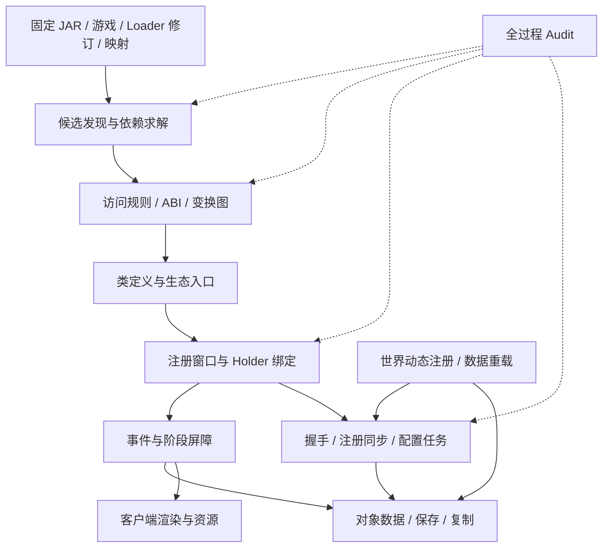

# 第三阶段调查：现有 JAR 的运行契约

调查日期：2026-10-06，日本时间。目标 Minecraft **1.21.1 / Java 21**。本文的“第三阶段”指第三轮调查，不等同于 [04 中的实现阶段 3](04-prototype-roadmap.md)。

本轮覆盖用户提出的 11 个方向，采用前两轮固定的 Forge、NeoForge、Fabric API、Fabric Loader 提交，补查其构建、加载、注册、存档、网络和客户端源码。**完成的是静态调查与证据整理，没有启动游戏、执行转换器或进行原生客户端连接测试。** 来源包版本、取样路径、哈希和证据缺口见 [来源索引](stage3-sources.md) 与 [快照](stage3-snapshot.json)。

## 1. 调查结论与交付物

| 用户方向 | 结论 | 专项文档 |
| --- | --- | --- |
| 1. 注册表与动态注册表 | 一套实际注册表，保留直接注册和延迟注册的可见性；动态内容属于世界 / 连接上下文 | [07 — 注册窗口](07-registries.md) |
| 2. AT / AW / injected interface | 权限变更、接口 ABI、父类 / 方法结构分别处理；构建步骤和加载步骤分开 | [08 — 访问与变换管线](08-access-and-transformers.md) |
| 3. Coremod / Transformer 排序 | ModLauncher 有分阶段插件和投票转换器；同阶段内部顺序不能凭模组顺序推定 | [08 — 访问与变换管线](08-access-and-transformers.md) |
| 4. 发现、依赖与元数据 | 各生态保留版本谓词和依赖语义，统一候选图、来源和类路径选择 | [09 — 模组发现](09-discovery-and-metadata.md) |
| 5. 事件总线 | 保留源总线内部语义，逐 Hook 定义跨生态结果组合规则 | [10 — 事件语义](10-event-semantics.md) |
| 6. Capability / Attachment / Component | 行为查询与数据存储分别立项；对象复制、失效、持久化和同步分别验收 | [11 — 对象数据生命周期](11-data-lifecycle.md) |
| 7. 网络握手 | 原生客户端能否连接取决于完整线协议与内容兼容，不能由 payload 注册成功推出 | [12 — 握手与连接边界](12-network-protocol.md) |
| 8. MixinExtras | 包装链和局部变量需要专门修复与审计，不能降格成普通 Inject | [13 — MixinExtras](13-mixinextras.md) |
| 9. 客户端渲染 | 单独定义支持范围；阶段、模型对象、渲染状态和资源生命周期均影响兼容 | [14 — 客户端](14-client-rendering.md) |
| 10. 数据包 / Reload / Datagen | 启动动态注册、运行重载、客户端资源和离线生成是不同流程 | [15 — 资源与数据流程](15-resources-and-datagen.md) |
| 11. 冲突诊断 | 记录每一步输入输出、候选与改写原因，并区分附着、执行和行为 | [16 — Audit 设计](16-transform-audit.md) |

第 11 项原消息止于“至少要记录：”，没有收到后续字段。本轮据前两轮调查补充一份审计字段草案，尚不代表用户指定的最终格式。

## 2. 优先级和依赖

**第一优先级是注册窗口、最终 ABI、变换时序、模组候选图和审计。** 这些决定一个未修改 JAR 能不能正确链接和完成初始化。事件与网络紧随其后；复杂数据和客户端领域可限制首批范围，但它们涉及的 ABI 或必需握手功能不能延后到初始化之后才发现。

这个图是建议的工程依赖，不是任何原生 Loader 的实际调用顺序。各专项明确区分“源码事实”“设计建议”“待执行探针”。

## 3. 对统一模型的修正

统一内核可以拥有同一组真实对象，但不能把所有原生 API 简化为同一个延迟队列、同一种事件结果或同一份网络频道表。例如 Fabric 直接注册后立即取用对象，而 NeoForge `DeferredRegister` 在匹配的 `RegisterEvent` 执行供应器；统一服务必须保留两种可观察行为。NeoForge `MappedRegistry` Patch 还改变了父类、注册 ID 和 Holder 绑定行为，这已经超出回调映射。[DeferredRegister][n-deferred]、[MappedRegistry Patch][n-mapped]

对于现有 JAR，建议将兼容能力声明为“指定版本与领域契约”，而不是“识别某生态元数据”。必要能力在构造模组前检查；动态反射、任意 coremod 和 plugin 生成目标无法全部静态证明，应保留运行检查与明确失败状态。

## 4. 验证计划的共同要求

各专项列出的探针全部为 **待执行**。每项固定原生环境、模组 JAR 哈希和输入世界，比较：

1. 发现与初始化轨迹，包括侧别、线程和阶段。
2. 最终类结构、注册内容与网络协商结果。
3. 实际游戏操作结果及保存、退出、重新读取。
4. 单模组和固定全集混装结果；通过子集不能替代全集。

探针编号使用 R（注册）、T（变换）、D（发现）、E（事件）、P（持久数据）、N（网络）、X（Extras）、C（客户端）、L（资源）、A（审计）。第二轮 M / X 编号保持原样；本轮 Extras 使用 `S3-X` 前缀避免重名。

## 5. 本轮仍未闭环的证据

- 没有产出可运行的依赖组合或 NeoForbric 内核；研究快照不是依赖锁文件。
- Forge 四个精确依赖源码包下载返回 HTTP 403；补查了对应版本系列的固定 Git 提交。它们支持机制分析，**尚未证明与 10.2.4 / 8.2.2 / 5.2.6 / 6.2.33 二进制完全一致**。
- 已读取 NeoForge 属性所声明的 ModLauncher 11.0.5、FML 4.0.45、Bus 8.0.2 等源码包，并补查 FML POM 中的 Bus 8.0.5 / Coremods 7.0.3。直接声明与传递依赖版本有差异，未做完整 Gradle 解析，不能将取样包表称为实际运行依赖组合；也未以运行日志确认插件顺序。
- 客户端渲染调查覆盖扩展类型、主要阶段和风险，未审计每个渲染 Patch，也未测第三方替代渲染器。
- 未完成协议字节级对照、存档迁移或真实模组兼容率统计。网络连接结论是有条件的工程判断。

[n-deferred]: https://github.com/neoforged/NeoForge/blob/a2d6402a3c1eec093aef7e7d10ac5145906c199e/src/main/java/net/neoforged/neoforge/registries/DeferredRegister.java
[n-mapped]: https://github.com/neoforged/NeoForge/blob/a2d6402a3c1eec093aef7e7d10ac5145906c199e/patches/net/minecraft/core/MappedRegistry.java.patch
